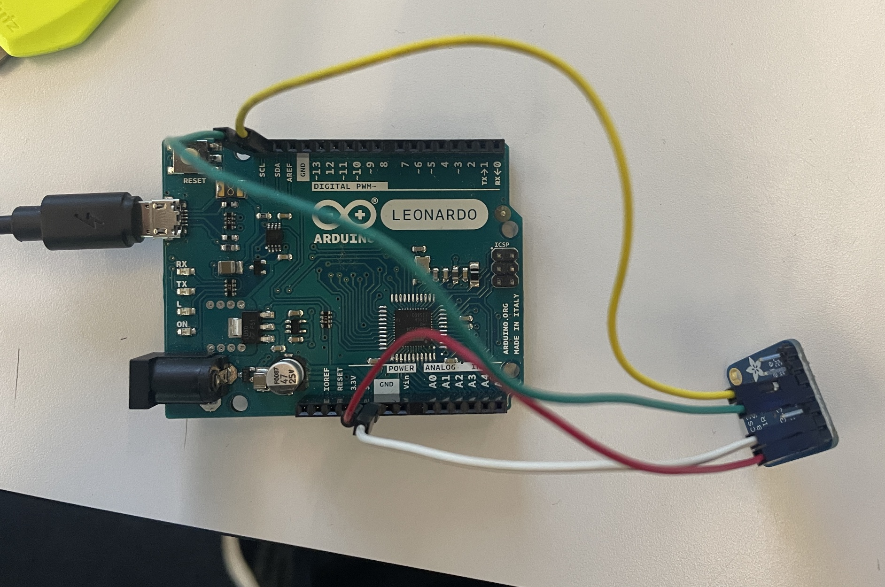

# arduino-color-sensor-p5

## Arduino
### Requirements
- Library [Adafruit_TCS34725](https://github.com/adafruit/Adafruit_TCS34725)
### Wiring

## Website
**Requirements**
- Web browser with Web Serial, ex: Google Chrome